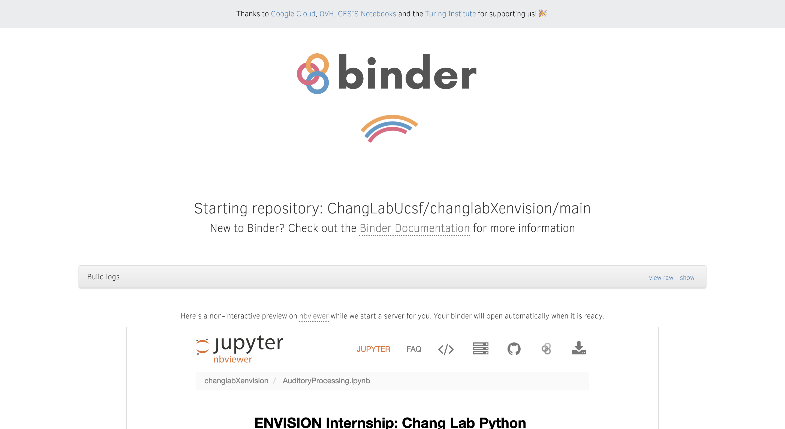
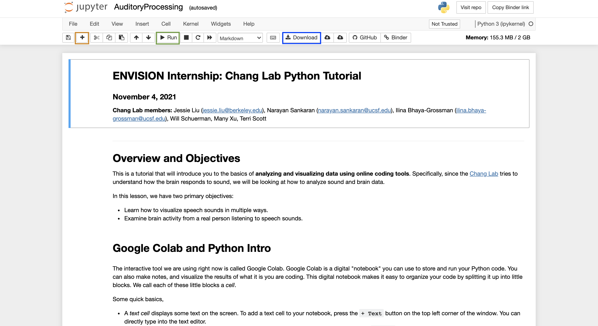
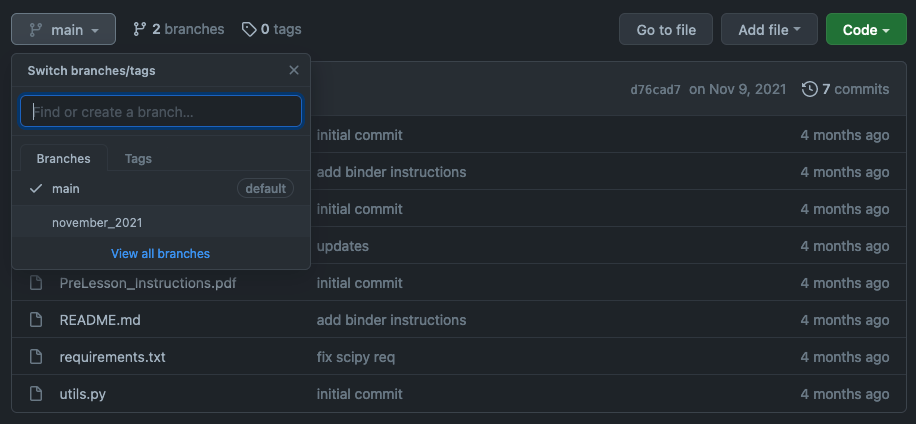

# changlabXenvision
This coding exercise was created by members of the [Chang Lab](http://changlab.ucsf.edu/) for internship students with the [ENVISION](https://neurosurgery.ucsf.edu/envision-internship-program) Program at UCSF.

## How to interact with the code
There are a few ways to interact with our code. 
We've described instructions for two ways, each with their own pros and cons.

1. Binder: If you're looking for minimal set-up, this is the way for you! 
   [Binder](https://mybinder.readthedocs.io/en/latest/about/index.html) is 
   a service that sets up the necessary environment for our code, all 
   within your browser. The downside is that any changes you make won't be 
   saved if you close the tab, but you can download the notebook with your 
   changes before closing the tab. This is great for quick interaction.
2. Google Colab: If you're looking to work more long-term on code and want 
   to save your changes, Google Colab is for you! There is a small amount 
   of setup (installing the Colab extension, uploading the code to Google 
   Drive), but this allows you to save your changes right to your Google Drive.

## Using Binder

1. Using Binder is simple, just click this badge :arrow_right:
    

2. A new tab will open and you'll have to wait a few minutes for the notebook 
to render.
The loading screen looks something like this:

   

3. When the notebook finishes rendering, you should see a Jupyter notebook 
   interface. In the image below, you can use the button outlined in orange 
   to add new code or text cells. To run a cell, select that cell and then 
   use the button outlined in green to run it. And to download the notebook 
   with your changes, use the button outlined in blue.

   

## Using Google Colab

### 1. Using Google and Google Chrome
1. We'll need to use [Google Chrome](https://www.google.com/chrome/) for 
   this, so download and install that if you don't already have it.
2. We'll also need a Google account to use Google Drive, [create a free account](https://accounts.google.com/signup/v2/webcreateaccount?flowName=GlifWebSignIn&flowEntry=SignUp) if you don't have one already.

### 2. Downloading the code
1. If you're not already at this link, go [here](https://github.com/ChangLabUcsf/changlabXenvision) to download the code.
2. First, we'll download a `.zip` file containing all the code and 
   resources in this repository. Find the green button at the top left corner of this page that says 
   "Code" and select the "Download ZIP" option.

   

3. Unzip this folder (on a Mac, simply double click the zipped file; on 
   Windows, right click and select "Extract All" and follow the 
   instructions). You should now see the contents of the folder.
4. Upload this folder to your Google Drive (under the "My Drive" heading. Don't put it within any folders). We'll be using Google 
   Colab to interact with the code. More details on that below.

### 3. Setting up Google Colab
Google Colab is a great way to execute code without having to install 
Python yourself. Google Colab opens notebooks through your Google Drive, so 
you can save your progress as you make changes.

1. Install the Google [Colab extension](https://chrome.google.com/webstore/detail/open-in-colab/iogfkhleblhcpcekbiedikdehleodpjo?hl=en) in Chrome.
2. Restart your Chrome browser by closing it and opening it again.

### 4. Testing that everything works!
1. In a Google Chrome browser, navigate to your Google Drive folder with the 
   notebook we'll be using (`AuditoryProcessing.ipynb`).
2. Double click on the file to open it--a tab should open with the Colab 
   interface.
    
3. Try executing the first code cell. You can do this by clicking on the cell 
   and pressing `Shift + Enter` or by clicking the "Play" button on the 
   left side of the cell. This cell will import one Python package and try 
   to set up your Google Drive so that we can load code and data 
   from our Google Drive folder.
   
4. It will ask you to open a link and log into your Google account, give 
   you a token, which you'll copy into the cell. If you have trouble at 
   this step, we'll walk through this at the beginning of the tutorial.
5. Otherwise, you're all set!

## For past ENVISION students
If you want to access the tutorial that was used during the ENVISION 
tutorial you participated in, you can switch to the relevant branch.

To do this, find the drop-down menu of branches and select the branch that 
matches the time you participated in ENVISION (for example, `november_2021`).
Once you select this branch, you can launch the Binder notebook or download 
the code as detailed above.

